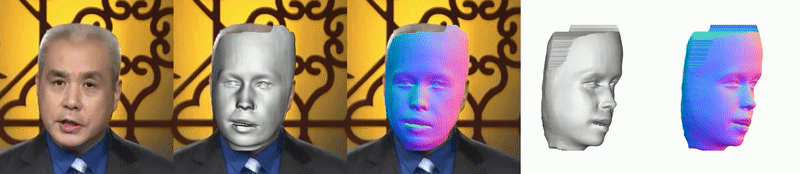
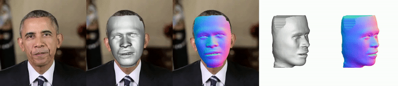

# RAFaRe
This is the official repository of ''Learning Robust and Accurate Non-parametric 3D Face Reconstruction from Pseudo 2D&3D Pairs'', AAAI 2023 (Oral). [[Project Page]](https://longwg.github.io/projects/RAFaRe/) [[arXiv]](https://arxiv.org/pdf/2302.05486.pdf)




### Environment

The project is tested on Ubuntu, [Anaconda](https://www.anaconda.com/) with Python 3.9.

```
conda create -n rafare python=3.9
conda activate rafare
conda install numpy==1.23.5 -y
conda install scikit-image==0.19.3 -y
conda install pytorch==1.12.0 torchvision==0.13.0 torchaudio==0.12.0 -c pytorch -y
conda install tqdm==4.64.1 -y
conda install -c conda-forge opencv==4.7.0 -y
conda install -c conda-forge trimesh==3.18.3 -y
conda install -c conda-forge einops==0.6.0 -y
conda install -c conda-forge pyrender==0.1.45 -y
conda install -c conda-forge addict==2.4.0 -y
conda install -c conda-forge yapf==0.32.0 -y
```

### Pretrained Model
Download from NJU drive:
```
./checkpoints/download_model_njudrive.sh
```

Or download from Google drive:
```
./checkpoints/download_model_googledrive.sh
```

### Run Testing

A pre-processing is required to crop the image to be square. Our method is not sensitive to the position of the face, and the size of the face should be 50%-90% of the image size.

Test a single image:
```
python3 ./tools/test_image_single.py --input_fn ./data/test_imgs/1.png --num_samples 180000 # for 24G GPU memory
python3 ./tools/test_image_single.py --input_fn ./data/test_imgs/1.png --num_samples 80000 # for 12G GPU memory
```

Test multiple images in a folder:
```
python3 ./tools/test_image_batch.py --input_dir ./data/test_imgs/ --num_samples 80000 # for 24 GPU memory
python3 ./tools/test_image_batch.py --input_dir ./data/test_imgs/ --num_samples 50000 # for 12 GPU memory
```

Test a video:
```
python3 ./tools/test_video.py --input_fn ./data/test_videos/baijia.mp4 --num_samples 80000 # for 24 GPU memory
python3 ./tools/test_video.py --input_fn ./data/test_videos/baijia.mp4 --num_samples 50000 # for 12 GPU memory
```

**Running time:**
| Method | Time(per image/frame) |
| :-----| :----: |
| test_imgae_single | 19.25s |
| test_image_batch | 15.09s |
| test_video | 14.97s |

### Reference

```
@inproceedings{guo2023rafare,
  title={RAFaRe: Learning Robust and Accurate Non-parametric 3D Face Reconstruction from Pseudo 2D&3D Pairs},
  author={Guo, Longwei and Zhu, Hao and Lu, Yuanxun and Wu, Menghua and Cao, Xun},
  booktitle={Proceedings of the AAAI Conference on Artificial Intelligence},
  year={2023}
}
```

### Acknowledge
The project depends heavily on [Open-PIFuHD](https://github.com/lingtengqiu/Open-PIFuhd), [PIFuHD](https://github.com/shunsukesaito/PIFuHD), [FaceScape](https://github.com/zhuhao-nju/facescape), [Pix2PixHD](https://github.com/NVIDIA/pix2pixHD), and [Face-Parsing](https://github.com/zllrunning/face-parsing.PyTorch). Thanks for sharing these cool projects.

